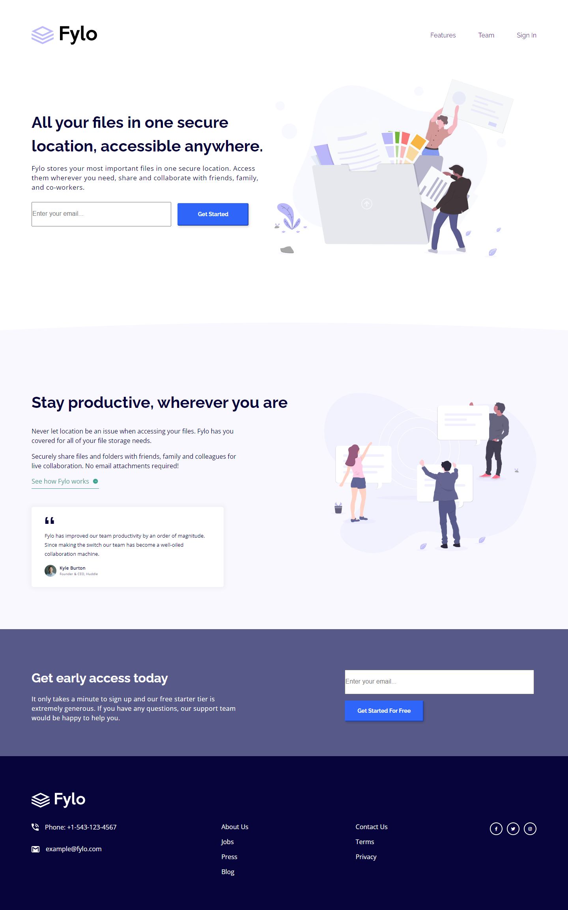
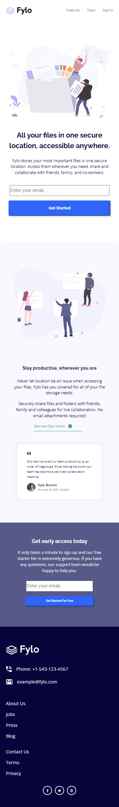

# Frontend Mentor - Fylo landing page with two column layout solution

This is a solution to the [Fylo landing page with two column layout challenge on Frontend Mentor](https://www.frontendmentor.io/challenges/fylo-landing-page-with-two-column-layout-5ca5ef041e82137ec91a50f5). Frontend Mentor challenges help you improve your coding skills by building realistic projects.

## Table of contents

- [Overview](#overview)
  - [The challenge](#the-challenge)
  - [Screenshot](#screenshot)
  - [Links](#links)
- [My process](#my-process)
  - [Built with](#built-with)
  - [What I learned](#what-i-learned)
  - [Continued development](#continued-development)
  - [Useful resources](#useful-resources)
- [Author](#author)
- [Acknowledgments](#acknowledgments)

## Overview

### The challenge

Users should be able to:

- View the optimal layout for the site depending on their device's screen size
- See hover states for all interactive elements on the page

### Screenshot

### Links

- Solution URL: [Add solution URL here](https://your-solution-url.com)
- Live Site URL: [Add live site URL here](https://your-live-site-url.com)

## My process

### Built with

- Semantic HTML5 markup
- CSS custom properties
- Flexbox
- CSS Grid
- Media queries

### What I learned

I learned how to use same class for three elements so it makes a lot easier to make this challenge.

### Continued development

I'll keep practising flexbox, CSS Grid and Media queries.

### Useful resources

- [A Complete Guide to Grid](https://css-tricks.com/snippets/css/complete-guide-grid/) - This helped me a lot ot understand CSS Grid.
- [A Complete Guide to Flexbox](https://css-tricks.com/snippets/css/a-guide-to-flexbox/) - This helped me a lot ot understand flex-box.
- [A Complete Guide to CSS Media Queries](https://css-tricks.com/a-complete-guide-to-css-media-queries/) - This helped me a lot to understand media queries.

## Author

- LinkedIn - [Darko Mijatovic](https://www.linkedin.com/in/darko-mijatovic-512384231/)
- Frontend Mentor - [@Darko96](https://www.frontendmentor.io/profile/Darko96)
- Instagram - [darkomiijatovic](https://www.instagram.com/darkomiijatovic/)

## Acknowledgments

I want to thank a lot to everyone in Frontend Mentor team. Because they made an awesome website where we can practice what we learn.

Thank you so much for checking my project and Any feedback is highly appreciated.
